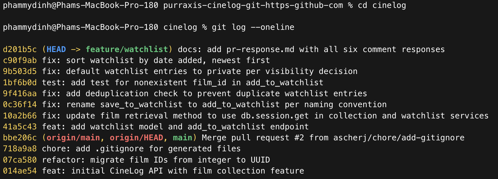

# PR Response Doc

## Comment 1 — Rename

**What I did:** Renamed `save_to_watchlist()` to `add_to_watchlist()` in
`services/watchlist_service.py` so it matches the project's `verb_to_noun`
service naming convention, following the existing `add_to_collection()` pattern.
I also updated the watchlist route import and call site in
`routes/watchlist/watchlist.py`.

**How I verified:** Ran `grep -rn "save_to_watchlist" .`; the only remaining
matches were compiled `.pyc` cache files. Ran `pytest tests/ -v`; 4 passed.

## Comment 2 — Deduplication

**What I did:** Added a duplicate check in `add_to_watchlist()` that mirrors
`add_to_collection()` exactly: query `WatchlistEntry` by `user_id` and
`film_id`, then raise `AlreadyInWatchlistError` if the entry already exists. I
added `AlreadyInWatchlistError` as a plain `Exception` subclass and updated the
docstring's `Raises:` section.

**How I verified:** Ran `pytest tests/ -v`; 4 passed. This confirms no
regression; the new duplicate behavior gets covered by the test in Comment 3.

## Comment 3 — Missing test

**What I did:** Added `tests/test_watchlist.py` with a nonexistent-film test for
`add_to_watchlist()`, using the same shape as
`test_add_to_collection_nonexistent_film_raises()` in `test_collection.py`.
Because this repo does not have a shared `conftest.py`, I copied over the small
local `app` and `sample_user` fixtures so the watchlist test can run on its own.

**How I verified:** Ran `pytest tests/test_watchlist.py -v`; 1 passed. Then ran
`pytest tests/ -v`; the full suite passed with 5 tests, so the duplicated
fixtures are not conflicting across files.

## Comment 4 — Default visibility

**My position:** I think new watchlist entries should default to private, so
I'm changing the default from `public=True` to `public=False`. If a user wants
to share a watchlist item, that should be an explicit choice.

**Why:** To me, a watchlist is closer to a personal note than a public review.
Adding something to it usually means "I might want to watch this later," not
"I want everyone to know this is on my radar." It can also reveal more than it
seems at first: taste, mood, gaps in what someone has seen, or just things they
are curious about. For that reason, private-by-default feels like the safer and
more respectful behavior.

**Tradeoff:** The downside is that we lose some easy social discovery. A public
default would make it simpler for friends to browse each other's planned watches
and might create more engagement. I still think privacy is the better default
here because a missed sharing opportunity is easy to fix later, but accidental
public visibility is much harder to take back.

## Comment 5 — Sort order

**My position:** I'm going with the maintainer's suggestion here: watchlists
should sort by `date_added` newest first, not alphabetically.

**Why:** A watchlist is about what someone currently intends to watch, and that
intent changes over time. Something added today is probably still fresh in the
user's mind and closer to what they want next than something they saved months
ago. Alphabetical order is tidy, but it ignores that timing signal. For a "what
should I watch next?" list, recency feels more useful than title order.

**How this responds to the review:** This lines up with @dev-lead's point that
most users expect to see their recent additions first. The alphabetical sort was
not really a watchlist-specific design decision; it was more like a default I
carried over from the existing listing pattern. Collections and watchlists do
different jobs, so it makes sense for their sort order to differ too.

## Comment 6 — Rebase

**What conflicted:** While this PR was open, `main` picked up commit `07ca580`,
which moved `Film.id` and related foreign keys from integer IDs to UUID strings.
That same main-branch state also did not have `WatchlistEntry` anymore, because
the watchlist feature only exists on this branch. During the rebase, Git stopped
in `models.py` on my private-default commit: `main` had no `WatchlistEntry`
class, while my branch was bringing it back with the old
`film_id = db.Column(db.Integer, ...)` type.

**How I resolved it:** I kept `WatchlistEntry`, since that model is part of the
watchlist feature, but updated its `film_id` column to
`db.Column(db.String(36), db.ForeignKey("film.id"), nullable=False)`. That makes
the watchlist model match the post-refactor UUID shape used by `Film.id` and
`CollectionEntry.film_id`.

**How I verified it:** Ran `grep -n "<<<<<<<\|=======\|>>>>>>>" models.py` and
confirmed there were no conflict markers left. Then I ran `pytest tests/ -v`
after the rebase finished, and all 5 tests passed.

## Final history cleanup

I cleaned up the branch history after addressing the review comments. I reworded
the original watchlist commit so it uses the project's conventional commit
format, kept the code/test fixes as separate logical commits, and squashed the
multiple `pr-response.md` updates into one docs commit. I also checked
`git log --oneline --merges origin/main..HEAD`, which returned no merge commits.



## PR Description

### What this PR does

Adds a watchlist feature to CineLog, letting users save films they want to
watch later. Includes:
- `add_to_watchlist(user_id, film_id)` — adds a film to a user's watchlist,
  with duplicate-prevention (raises `AlreadyInWatchlistError` if the film
  is already saved)
- `get_watchlist(user_id)` — returns a user's watchlist, sorted by date
  added (newest first)
- REST endpoints: `GET /watchlist/<user_id>` and `POST /watchlist/<user_id>/add`

### Design decisions

**Default visibility:** Watchlist entries default to `public=False` (private).
A watchlist reflects personal, in-progress intent to watch something, not a
public statement — defaulting to private avoids surprising users with
unintended exposure. This trades off some social-discovery value, but I
think that's the safer default for user trust.

**Sort order:** Watchlists are sorted by `date_added`, newest first, rather
than alphabetically. Recently-added films are more likely to reflect a
user's current interest than something added weeks ago, so recency is a
more useful signal than alphabetical order for a "what do I want to watch
next" list.

### Manual testing

1. Start the app: `python app.py`
2. Add a film to a watchlist:
   ```bash
   curl -X POST http://127.0.0.1:5000/watchlist/<user_id>/add \
     -H "Content-Type: application/json" \
     -d '{"film_id": "<film_uuid>"}'
   ```
3. View the watchlist (should return the added film, `public: false`):
   ```bash
   curl http://127.0.0.1:5000/watchlist/<user_id>
   ```
4. Add the same film again — should raise `AlreadyInWatchlistError` rather
   than creating a duplicate entry.
5. Add a second film, then view the watchlist again — confirm the most
   recently added film appears first.
6. Try adding a nonexistent `film_id` — should raise `FilmNotFoundError`.

Full test suite: `pytest tests/ -v` — 5 passed.
